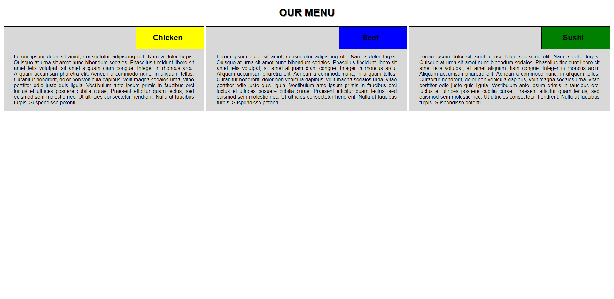

# module2-solution
Module 2 Solution - Coursera - HTML, CSS e Javascript para Desenvolvedores Web by Johns Hopkins University

* This is the Assignment 2 final version. In this assignment, the main idea is work with Responsive Layout without Bootstrap or another library/framework for this purpose. The project consists in use native CSS techniques.

Below, we have screenshots that show the responsive layout result:

<b>DESKTOP VERSION:</b>
 
In the desktop view (992px and above), each of the 3 sections should take up equal amount of space on the screen.
 

<b>TABLET VERSION:</b>
 
In the tablet view (between 768px and 991px, inclusively), the first 2 sections should be in the first row and be of equal size. The 3rd section should be in the second row and take up the entire row by itself.

<b>MOBILE VERSION:</b>
 
In the mobile view (equal to or less than 767px), each section should take up the entire row.

